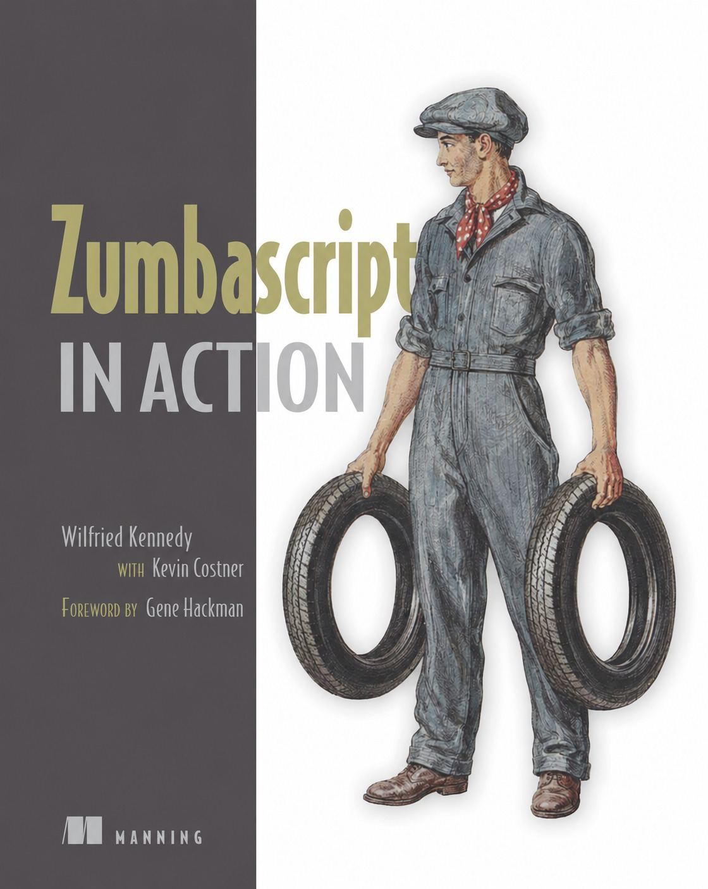

# Zumbascript

<p align="center"></img></p>

As in **_`Zumba`_** + _`Script`_ [^1]

[^1]: Self-explanatory.

## Grammar (so far)

```
program:                            global_statements
global_statements:                  (assignment SEMI | function_decl)* function_decl

function_decl:                      FUNCTION ID LPAREN function_args RPAREN compound_statement
function_args:                      empty | function_args_list
function_args_list:                 ID (COMMA ID)*

compound_statement:                 LBRACE statements_list RBRACE
statements_list:                    (statement SEMI)*
statement:                          expr | assignment | if_block | return_statement

loop_compound_statement:            LBRACE loop_statements_list RBRACE
loop_statements_list:               ((statement | loop_statement) SEMI)*
loop_statements:					break | continue | statement

expr:                               arithmetic ((LT | LE | EQ | GE | GT) arithmetic)*
arithmetic:                         term ((PLUS | MINUS) term)*
term:                               factor ((MUL | DIV) factor)*
factor:                             PLUS factor
								    | MINUS factor
								    | INTEGER
								    | LPAREN expr RPAREN
                                    | variable
								    | function_call
                                    | array_subscript
								    | STRING


assignment:                         lvalue ASSIGN expr
lvalue:                             ID | array_subscript

if_block:                           IF LPAREN expr RPAREN compound_statement |  IF LPAREN expr RPAREN compound_statement else_block
else_block:                         ELSE compound_statement | ELSE if_block
while_block:                        WHILE LPAREN expr RPAREN loop_compound_statement
return_statements:                  RETURN expr

function_call:                      ID LPAREN call_args RPAREN
call_args:                          empty | call_args_list
call_args_list:                     expr (COMMA expr)*

variable:                           ID

array_literal:                      LBRACKET array_elements RBRACKET
array_elements:                     empty | expr (COMMA expr)
array_subscript:                    lvalue LBRACKET expr RBRACKET
```

## Learning Resources

<p align="center"></img></p>

## TODO

- [x] Parser

  - [x] Parse function declarations in global scope
  - [x] Parse control flow
  - [x] If block
  - [x] Else block
  - [x] While block
    - [x] Break statement
    - [x] Continue statement
  - [x] Integer arithmetic (`+` `-` `*` `/` `%`)
  - [x] Comparison operators (`<` `<=` `==` `!=` `>=` `>`)
  - [x] Logical operators (`&&` `||` `!`)
  - [x] Floats
  - [x] Strings
    - [x] String declaration
    - [x] String arithmetics (`+` concatenation)
    - [x] Subscripting (`s[i]`)
    - [x] Slicing (`s[lo..hi]`)
  - [x] Arrays
    - [x] Array literals
    - [x] Array concatenation (`+`)
    - [x] Subscripting (`a[i]`)
    - [x] Slicing (`a[lo..hi]`)
  - [x] Structs
  - [x] `panic()` builtin
  - [x] `//` line comments
  - [ ] Bitwise operators (`&` `|` `^` `~` `<<` `>>`)
  - [ ] `for` loop
  - [ ] Standard library (`open`, `read`, `write`)
  - [ ] Import system

- [x] Interpreter
  - [x] Global statements
  - [x] Expressions
  - [x] Integer arithmetic (`+` `-` `*` `/` `%`)
  - [x] Comparison operators (`<` `<=` `==` `!=` `>=` `>`)
  - [x] Logical operators (`&&` `||` `!`) with short-circuit evaluation
  - [x] Functions
  - [x] Global hoisted declarations
  - [x] Calls with argument passing
  - [x] Recursion (call depth limit: 1000)
  - [x] Control flow
    - [x] If / else if / else block
    - [x] While block with break and continue
  - [x] Typing rules
    - [x] Truthiness for all types (integer, float, string, array, object, void)
    - [x] Unified binary op dispatch (int/float/string/array/void)
    - [x] Int/float promotion in mixed arithmetic
    - [x] Unary `-` and `!` for all types
  - [x] Strings
    - [x] String equality (`==` / `!=`)
    - [x] String concatenation (`+`)
    - [x] Subscripting (`s[i]` → 1-char string, bounds-checked)
    - [x] Slicing (`s[lo..hi]` → substring, bounds-checked)
  - [x] Floats (`f64`, int/float promotion)
  - [x] Arrays
    - [x] Array literals (`[]`, `[e1, e2, ...]`)
    - [x] Array concatenation (`a + b` → new array)
    - [x] Subscripting (read `a[i]` + write `a[i] = x`, bounds-checked)
    - [x] Slicing (`a[lo..hi]` → new array, bounds-checked)
  - [x] Structs (declaration, literal, field read/write)
  - [x] Runtime error trace (error name + source line + call chain)
  - [x] `panic(msg)` builtin
  - [ ] Bitwise operators (`&` `|` `^` `~` `<<` `>>`)
  - [ ] `for` loop
  - [ ] Standard library
    - [ ] `print(val)` / `println(val)`
    - [ ] `len(s_or_arr)`
    - [ ] `int(x)` / `float(x)` / `str(x)` — type coercion
    - [ ] `open(path, mode)` / `read(fd)` / `write(fd, val)`

## Resources

### Basics

[Crafting interpreters - Robert Nystrom](https://craftinginterpreters.com)

[A simple interpreter from scratch in Python @Jaycon Rod's blog](https://web.archive.org/web/20130616090724/http://www.jayconrod.com/posts/40/a-simple-interpreter-from-scratch-in-python-part-4)

### Memory allocation

[Tip of the day #2 - A safer Arena allocator @Gaultier's blog](https://gaultier.github.io/blog/tip_of_the_day_2.html)

[Untangling Lifetimes - The Arena Allocator @rfleury's blog](https://www.rfleury.com/p/untangling-lifetimes-the-arena-allocator)

### Zig

[Runtime Polymorphism in Zig - Zig SHOWTIME - Alex Naskos @youtube](https://www.youtube.com/watch?v=AHc4x1uXBQE)

[HTML Parser from Scratch in Zig @youtube](https://www.youtube.com/watch?v=OrU_6VdItJA)
